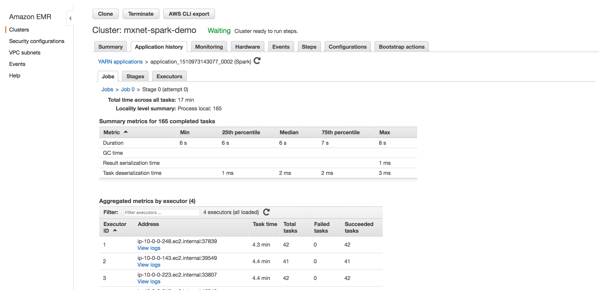
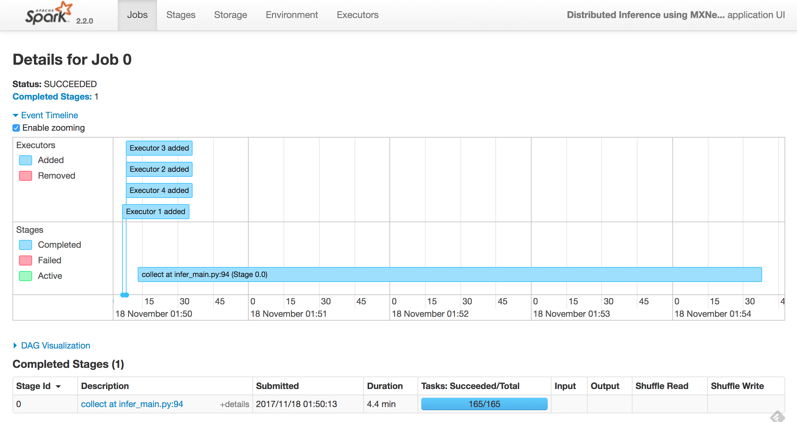

# Distributed Inference using Apache MXNet and Apache Spark on Amazon EMR

In this article we will demonstrate how to run distributed offline inference on large datasets using [Aapche MXNet](http://mxnet.apache.org/) (incubating) and [Apache Spark](https://spark.apache.org/) on [Amazon EMR](https://aws.amazon.com/emr/) platform. We will explain how offline inference is useful, why it is challenging, and how you can leverage MXNet and Spark on Amazon EMR to overcome this challenge.

## Distributed Inference on Large Datasets - Need and Challenges

Once a deep learning model has been trained, it is put to work by running inference on new data. Inference may be executed in real-time, for tasks that require immediate feedback such as fraud detection. This is typically known as online inference. Alternatively, inference may be executed offline, when a pre-computation is useful. A common use case for offline inference are services with low-latency requirements such as recommender systems  that requires sorting and ranking many user-product scores. In these cases, recommendations  that requires sorting and ranking many user-product scoresare pre-computed using offline inference, results are stored in low latency storage, and on demand, recommendations are served from storage. 
Backfilling historic data with predictions generated from state of the art models is another use case. As a hypothetical example, NY Times could use this setup to backfill archived photographs with person names predicated from a person detection model. Distributed inference can also be used for testing new models on historical data to verify if they yield better results before deploying to production.

Typically, distributed inference is performed on large scale datasets spanning millions of records or more.
Processing such massive datasets within a reasonable amount of time require a cluster of machines set up with deep learning capabilities.
A distributed cluster enables high throughput processing via data partitioning, batching and task parallelization. However, setting up a deep learning data processing cluster comes with challenges:
* **Cluster Setup and Management**: Setting up and monitoring nodes, maintaining high availability, deploying and configuring software packages, and more.
* **Resource and Job Management**: Scheduling and tracking jobs, partitioning data and handling job failures.
* **Deep learning setup**: deploying, configuring and running deep learning tasks.

Next, we will show how to solve this challenge using MXNet and Spark on the Amazon EMR platform.

## Using MXNet and Spark for Distributed Inference.
Amazon EMR makes it easy and cost effective to launch scalable clusters with Spark and MXNet. EMR is billed per-second and can use EC2 spot instances to lower costs for workloads.

EMR along with Spark simplifies the task of cluster and distributed job management. Spark is a cluster computing framework that enables variety of data processing applications. Spark also efficiently partitions data across the cluster to parallelize processing. Spark tightly integrates with the [Apache Hadoop](http://hadoop.apache.org/) ecosystem and several other big data solutions.

MXNet is a fast and scalable deep learning framework that is optimized for performance on both CPU and GPU.

We will walk through the steps to setup and execute offline distributed inference on a large dataset, using Spark and MXNet on Amazon EMR. We will use a pre-trained [ResNet-18](http://data.mxnet.io/models/imagenet/resnet/18-layers/) image recognition model, available on the MXNet [model zoo](http://data.mxnet.io/models/). We will run inference against the publicly available CIFAR-10 dataset that contains 60,000 color images. The example will demonstrate running inference on CPUs, but one can easily extended to use GPUs.

The high level steps for the setup and execution are listed below, and laid out in detail in the following sections:

* Setup MXNet and Spark on EMR.
* Initialize Spark application.
* Load and partition data on the cluster.
* Fetch and load data into Spark executors.
* Inference using MXNet on the executors.
* Collecting predictions.
* Running Inference application using `spark-submit`.
* Monitor Spark application.

### MXNet and Spark Cluster Setup on Amazon EMR.
We will use Amazon EMR to create a cluster with Spark and MXNet which you can install as applications using [EMR 5.10.0 - fix my link](https://aws.amazon.com/emr/) We will use [AWS CLI](https://aws.amazon.com/cli/) to create the cluster of **4 core instances of c4.8xlarge type and 1 master of m3.xlarge type**, but you can also create using the EMR console.

The command to create the cluster is below, this assumes you have the right credentials to create. 
```bash
aws emr create-cluster \
--applications Name=MXNet Name=Spark \
--release-label emr-5.10.0 \
--service-role EMR_DefaultRole \
--ec2-attributes InstanceProfile=EMR_EC2_DefaultRole,KeyName=<YOUR-KEYPAIR>,SubnetId=<YOUR-SUBNET-ID> \
--instance-groups InstanceGroupType=MASTER,InstanceCount=1,InstanceType=m3.xlarge \
InstanceGroupType=CORE,InstanceCount=4,InstanceType=c4.8xlarge \
--log-uri 's3n://<YOUR-S3-BUCKET-FOR-EMR-LOGS>/' \
--bootstrap-actions Name='install-pillow-boto3',Path=s3://aws-dl-emr-bootstrap/mxnet-spark-demo-bootstrap.sh \
--region <AWS-REGION> \
--name "mxnet-spark-demo"
```
Substitute the below arguments:

* `<YOUR-KEYPAIR>` - Your EC2 Key Pair to ssh into the master.
* `<YOUR-SUBNET-ID>` - Subnet in which to launch the cluster, you have to pass this argument to create high compute instances such c4.8xlarge
* `<AWS-REGION>` - AWS region where you want to launch the cluster
* `<YOUR-S3-BUCKET-FOR-EMR-LOGS>` - S3 bucket where EMR logs should be stored.

`--bootstrap-actions` is used to install git, pillow, boto libraries.

You can find more information about IAM roles needed to setup a EMR cluster [here](http://docs.aws.amazon.com/emr/latest/ManagementGuide/emr-iam-roles-creatingroles.html)

The code snippets that we discuss below are available in [deeplearning-emr](https://github.com/awslabs/deeplearning-emr) Github repository under the `mxnet-spark` folder. It contains the complete code for running inference using MXNet and Spark. We will also discuss how to submit spark application using `spark-submit` in one of the sub-sections below. The `mxnet-spark` folder contains 3 files,  
 
* [infer_main.py](https://github.com/awslabs/deeplearning-emr/mxnet-spark/infer_main.py) contains the code to run on the driver, 
* [utils.py](https://github.com/awslabs/deeplearning-emr/mxnet-spark/utils.py) contains a few helper methods, and 
* [mxinfer.py](https://github.com/awslabs/deeplearning-emr/mxnet-spark/mxinfer.py) contains the code to download the model files on the worker nodes, Load bytes into numpy and run prediction on a batch of images.

### Initialization.
We will use [PySpark](https://spark.apache.org/docs/0.9.0/python-programming-guide.html) - Spark's Python interface, to create our application. A Spark application consists of a single **driver** program that runs the user's main function and one or more **executor** processes that run various tasks in parallel.

To execute a Spark application, the driver splits up the work into jobs. Each job is further split into stages and each stage consists of a set of independent tasks that run in parallel. A task is the smallest unit of work in Spark and executes the same code, each on a different data partition - logical chunk of a large distributed data set.


**Image Credit:** [Apache Spark Docs](https://spark.apache.org/docs/latest/cluster-overview.html)

Spark provides an abstraction to work with a distributed dataset - Resilient Distributed Dataset(RDD). RDD is an immutable distributed collection of objects partitioned across the cluster that can be operated on in parallel. RDDs can be created either by parallelizing a collection or an external dataset.

The pipeline of our distributed inference application at a high level looks like:


Spark by default creates one task per core on the executor. Since MXNet has built-in parallelism to efficiently use all the CPU cores, we'll configure our application to create only one task per executor and let MXNet all the cores on the instance.
In the below code we will set the configuration key `spark.executor.cores` to `1`, and pass the `conf` object when creating `SparkContext`. When submitting the application, you'll see that we also set the number of executors to the number of workers available on the cluster, there by forcing one executor per node instead of using the default setting for dynamic allocation of executors.

```Python
conf = SparkConf().setAppName("Distributed Inference using MXNet and Spark")
conf.set('spark.executor.cores', '1')

sc = pyspark.SparkContext(conf=conf)
logger.info("Spark Context created")
```

### Load and partition data on the cluster.
We have already copied CIFAR-10 data into a [Amazon S3](https://aws.amazon.com/s3/) bucket `mxnet-spark-demo`. Since the data stored in S3, can be accessed on all nodes we do not have to move data between the driver and executors. We will fetch only the S3 keys on the driver and create an RDD of keys using the [boto](http://boto.cloudhackers.com/en/latest/) library - Python interface to access AWS Services. 
This RDD will be partitioned and distributed to the executors in the cluster and we will fetch and process the mini-batch of images directly on the executors.

We will use the helper method ```fetch_s3_keys``` from [utils.py](https://github.com/awslabs/deeplearning-emr/mxnet-spark/utils.py) to get all the keys from an S3 bucket, this method also takes a prefix to list keys that start with that prefix. The arguments are passed when you submit the main application.

```Python
s3_client = get_s3client(args['access_key'], args['secret_key'])
keys = fetch_s3_keys(args['bucket'], args['prefix'], s3_client)
```

The batch size as determined by `args['batch']` is the number of images that can be fetched, preprocessed and run inference on each executor at once. This is bound by how much memory is available for each task. `args['access_key']` and  `args['secret_key']` are optional arguments to access the S3 bucket in another account if Instance Role is setup with the right permissions the script will  automatically use the IAM role that was assigned to the cluster at launch.

We will split the RDD of `keys` into partitions with each partition containing a mini-batch of image keys. If the keys cannot be perfectly divided into partitions of batch size, we will fill the last partition to reuse some of the initial set of keys. This is needed since we will be binding(see below) to a fixed batch size.


```Python
n_partitions = n_keys // args['batch']
# if keys cannot be divided by args['batch'] .
if (n_partitions * args['batch'] != n_keys):
  keys.extend(keys[: args['batch'] - (n_keys - n_partitions * args['batch'])])
  n_partitions = len(keys) // args['batch']

rdd = sc.parallelize(keys, num_slices=n_partitions)
```

### Fetch and Load data into Spark Executors

In Apache Spark, you can perform two types of operations on RDDs  
a) **Transformation** operates on the data in one RDD and creates a new RDD 
b) **Action** computes results on an RDD. 

Transformations on RDDs are **lazily evaluated** i.e., Spark will not execute the transformations until it sees an action, instead, Spark keeps track of the dependencies between different RDDs by creating directed acyclic graph that lead up to the action to form an execution plan. This helps in computing RDDs on demand and in recovery in case of a partition of the RDD is lost.

We will use Spark's `mapPartitions`- that provides an iterator to the records of the partition, the transformation method is run separately on each partition (block) of the RDD. We will use the `download_objects` method from utils.py as transformation on the RDD partition to download all the images of the partition from S3 into memory. 

```Python
sc.broadcast(args['bucket'])
rdd = rdd.mapPartitions(lambda k : download_objects(args['bucket'], k))
```

We will run another transformation to tranform the each image in memory into a numpy array object using [Python Pillow](https://python-pillow.org/) - Python Imaging Library. We will use pillow to decode the images(in png format) in memory and translate to an numpy object. This is done in the `read_images` and `load_images` of [mxinfer.py](https://github.com/awslabs/deeplearning-emr/mxnet-spark/mxinfer.py). 

```Python
rdd = rdd.mapPartitions(load_images)
```

```Python
def load_images(images):
    """
    Decodes batch of image bytes and returns a 4-D numpy array.
    
    """    
    import numpy as np
    batch = []
    for image in images:
        img_np = readImage(image)
        batch.append(img_np)

    batch_images = np.concatenate(batch)

    logger.info('batch_images.shape:%s'%(str(batch_images.shape)))

    return batch_images

def readImage(img_bytes):
    """
    Decodes an Image bytearray into 3-D numpy array.
    
    """
    from PIL import Image
    import numpy as np
    import io
    from array import array
    img = io.BytesIO(bytearray(img_bytes))
    # read the bytearray using OpenCV and convert to RGB
    img = Image.open(img)
    img = img.convert('RGB')
    #resize the image to 224x224
    img = img.resize((224, 224), Image.ANTIALIAS)    
    # reshape the array from (height, width, channel) to (channel, height, width)  
    img = np.swapaxes(img, 0, 2)
    img = np.swapaxes(img, 1, 2)
    # add a new axis to hold a batch of images.
    img = img[np.newaxis, :]
    return img

```
**Note:** In this application, you will see that *we are importing the modules(numpy, mxnet, pillow, etc.,) inside the mapPartitions function instead of once at the top of the file. This is because PySpark will try to serialize all the modules and any dependent libraries that are imported at the module level and most often fail pickling the modules and any other associated binaries of the module*. Otherwise Spark will expect that the routines and libraries are available on the nodes, we will ship the routines as code files when we submit the application using `spark-submit` script, the libraries are already installed on all the nodes. One more thing to look out for is if you use a member of an object in your function, Spark could end up serializing the entire object. 

### Inference using MXNet on the Executors
As stated above we will be running one executor per node and one task per executor for this application. 

Before running inference, we have to load the model files.The `MXModel` class in [mxinfer.py](https://github.com/awslabs/deeplearning-emr/mxnet-spark/mxinfer.py) downloads the model files from MXNet model zoo and creates a MXNet Module and stores in the `MXModel` class at first use. We implemented a singleton pattern so that we do not have to instantiate and load the model for every preidiction.

The  `download_model_files` method in the MXModel singleton class will download the ResNet-18 model files. The model consists of a Symbol file with .json extension that describes the neural network graph and a binary file with .params extension containing the model parameters. For classification models, there will be a synsets.txt containing the classes and their corresponding labels.

After downloading the model files, we will load them and instantiate MXNet module object in the `init_module` routine that performs the following steps:
* load the symbol file and create a input Symbol, load parameters into an MXNet NDArray and parse `arg_params` and `aux_params`.
* create a new MXNet module and assign the symbol.
* bind symbol to input data.
* set model parameters.

```Python
    def init_module(self, s_fname, p_fname, batch_size):
        logger.info("initializing model")
        
        import mxnet as mx        
        #load the symbol file
        sym = mx.symbol.load(s_fname)
        
        #load parameters
        save_dict = mx.nd.load(p_fname)
        
        arg_params = {}
        aux_params = {}
        
        for k, v in save_dict.items():
            tp, name = k.split(':', 1)
            if tp == 'arg':
                arg_params[name] = v
            if tp == 'aux':
                aux_params[name] = v
        
        mod = mx.mod.Module(symbol=sym)
        
        #bind data shapes and label. This model was trained with an image 224x224 resolution with 3(RGB) channels.
        mod.bind(for_training = False, data_shapes=[('data', (batch_size,3,224,224))],
                 label_shapes = None)
        #set parameters
        mod.set_params(arg_params, aux_params, allow_missing=True)
        
        return mod
```

We will download and instantiate MXModel object once on the first call to the predict method. The predict transformation method also takes a 4-dimensional array holding a batch (of size `args['batch']`) of color images (the other 3 dimensions of RGB) and calls the MXNet module `forward` method to produce the predictions for that batch of images. 

*Note that we are importing the `mxnet` and `numpy` modules within this method for the reasons discussed in the note earlier.*
```Python
def predict(img_batch, args):
    """
    Run predication on batch of images in 4-D numpy array format and return the top_5 probability along with their classes.
    """
    import mxnet as mx
    import numpy as np
    logger.info('predict-args:%s' %(args))
 
    if not MXModel.model_loaded:
        MXModel(args['sym_url'], args['param_url'], args['label_url'], args['batch'])
    
    MXModel.mod.forward(Batch([mx.nd.array(img_batch)]))    
```

### Running the Inference Spark Application
1) First clone the [deeplearning-emr](https://github.com/awslabs/deeplearning-emr) Github repository that contain the codes for running Inference using MXNet and Spark.

```bash
git clone https://github.com/awslabs/deeplearning-emr.git && cd deeplearning-emr/mxnet-spark
```

We will use the ```spark-submit``` script to run our Spark Application. 

```bash
export LD_PATH=$LD_LIBRARY_PATH ; spark-submit --deploy-mode cluster \
--master yarn --conf spark.dynamicAllocation.enabled=false \
--conf spark.executor.memory=40g \
--conf spark.executorEnv.LD_LIBRARY_PATH=\$LD_PATH \
--driver-library-path \$LD_PATH \
--num-executors 4 \
--py-files utils.py,mxinfer.py \
infer_main.py --sym_url 'http://data.mxnet.io/models/imagenet/resnet/18-layers/resnet-18-symbol.json' \
--param_url 'http://data.mxnet.io/models/imagenet/resnet/18-layers/resnet-18-0000.params' \
--label_url 'http://data.mxnet.io/models/imagenet/resnet/synset.txt' \
--batch 64 \
--bucket 'mxnet-spark-demo' \
--prefix 'cifar10/test' \
--output_s3_bucket `<YOUR_S3_BUCKET>` \
--output_s3_key 'cifar10_test_results'
```
**Note:** Replace `<YOUR_S3_BUCKET>` with the s3 bucket you want to store the result. You should have either pass access/secret key or have permission in the Instance IAM Role.

The arguments to the spark-submit are:

* `--py-files`: comma separated list of code files(without spaces) that need to be shipped to the workers.  
* `--deploy-mode`: `cluster` or `client`. When you run the application in the cluster mode, Spark would choose one of the workers to run the driver and the executor.  `cluster` mode is useful when you have a large cluster size, the master node on EMR cluster could be busy running webservers for Hadoop, Spark, etc., You could run the application in the `client` deploy mode.  
* `--master`: `yarn`.  
* `--conf spark.executor.memory=`: The amount of memory that can used by each executor.  
* `--conf spark.executorEnv.LD_LIBRARY_PATH` and `--driver-library-path`: set to `LD_LIBRARY_PATH`
* `--num-executors`: This is the number of workers in your cluster(excluding the EMR master).  
* `infer_main.py`: is the main program that starts the Spark application and it takes arguments s3 bucket, s3 key prefix, batch size, etc,.  
* `--batch`: the number of images that can be processed at a time on each executor. This is bound by the memory and cpu available on each worker node.

### Collecting predictions.
Finally, we will collect the predictions generated for each partition using Spark `collect` action and write the predictions to S3. The S3 location(`args['output_s3_bucket']`, `args['output_s3_key']`) to which results should be written can be passed as an argument to the `infer_main.py`

```Python
    output = rdd.collect()
    # drop the extra keys that we added to fill the last batch
    keys = keys[:n_keys]
    output = output[:n_keys]
  
    if args['output_s3_key'] and args['output_s3_bucket']:
        with open('/tmp/' + args['output_s3_key'] , 'w+') as f:
            for k, o in zip(keys, output):
                f.write("Key %s: Prediction: %s\n" % (k, o))
        upload_file(args['output_s3_bucket'], args['output_s3_key'], '/tmp/' + args['output_s3_key'], s3_client)
```

### Monitoring the Spark Application
 You can view Spark application history and YARN application status right in the Amazon EMR console, Application history is updated throughout runtime in near real-time, and the history is available for up to seven days after the application is complete **even after you have terminated the cluster**. It also provides advanced metrics like memory usage, S3 reads, HDFS utilization, etc., all in one place. This also eliminates the need SSH forwarding unlike to use YARN UI. 
 You can find the features and how to use in [Spark Application History on EMR Console](http://docs.aws.amazon.com/emr/latest/ManagementGuide/emr-cluster-application-history.html). 
 
 The below screenshot from the EMR console Applicaiton History shows the application tasks, execution times, etc., 
 


Spark Applications running on EMR can also be monitored using the Yarn ResourceManager Web UI on port 8088 on the driver host. The various Web UIs available on the EMR cluster and how to access them are listed here [YARN Web UI on EMR](https://docs.aws.amazon.com/emr/latest/ManagementGuide/emr-web-interfaces.html).

A screenshot of the web monitoring tool is shown below. We can see the execution timeline, job duration and task success and failures.




Another great feature of Amazon EMR is the integration with [Amazon CloudWatch](https://aws.amazon.com/cloudwatch/), which allows monitoring of cluster resources and applications. In the screenshot below we can see the CPU utilization across the cluster nodes, which stayed below 25%.


## Summary
To summarize, we demonstrated setting up a Spark cluster of 4 nodes, that uses MXNet to run distributed inference across 10000 images stored on S3, completing the processing within 5(4.4) minutes.

As demonstrated, Spark was able to automatically handle failures by rescheduling failed tasks on available executors eliminating the need for manual operator intervention.

## Learn More.
1) [Amazon EMR - Amazon Elastic MapReduce](https://aws.amazon.com/emr/)
2) [Apache Spark - Lightning-fast cluster computing](https://spark.apache.org/)
3) [Apache MXNet - Flexible and efficient deep learning.](http://mxnet.apache.org/)
4) [MXNet Symbol - Neural network graphs and auto-differentiation](http://mxnet.incubator.apache.org/tutorials/basic/symbol.html)
5) [MXNet Module - Neural network training and inference](http://mxnet.incubator.apache.org/tutorials/basic/module.html)
6) [MXNet - Using pre-trained models](http://mxnet.incubator.apache.org/tutorials/python/predict_image.html)
7) [Spark Cluster Overview](https://spark.apache.org/docs/2.2.0/cluster-overview.html)
8) [Submitting Spark Applications](https://spark.apache.org/docs/2.2.0/submitting-applications.html)

## Future Improvements
* **Compute/IO access Optimization** - In this applicaiton we have observed that the Compute/IO access on the executors has a square wave pattern where IO(no compute) and compute(no IO) are interleaved. Ideally this can be optimized to parallelize IO and Compute, since we are using only one executor on each node this becomes challenging to manually manage resources utilization on each node.
* **Using GPUs**: Another big improvement would be to use GPUs to run inference on the batch of data.

## Acknowledgements
I would like to thank my colleagues at [Amazon AI](https://aws.amazon.com/amazon-ai/) who helped in brainstorming and providing valuable feedback for this work.

* Madan Jampani - Principal Engineer, Amazon AI.
* Hagay Lupesko - Software Development Manager, Amazon AI.
* Roshani Nagmote - Sofware Engineer, Amazon AI.

```sequence

```

```sequence

```